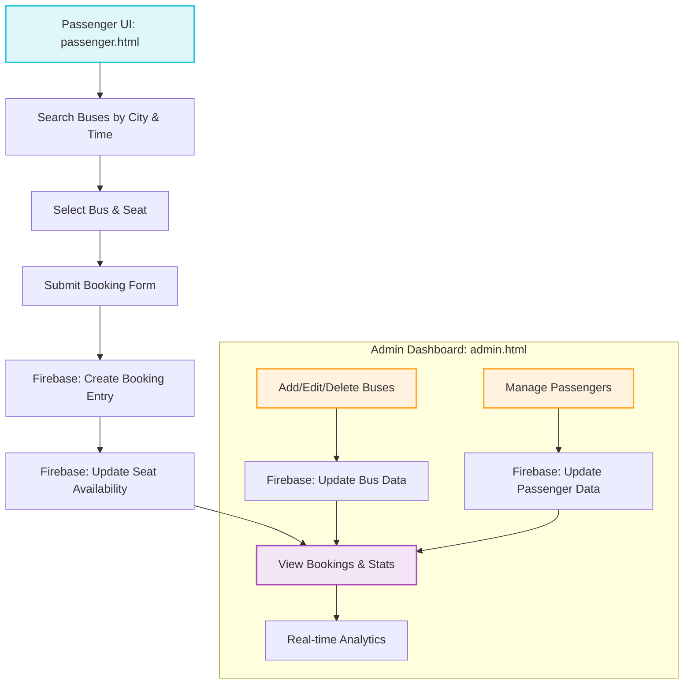

# EasyRide Bus Ticket Management System

**EasyRide** is a comprehensive, real-time **Bus Ticket Management System** built with care and attention to detail. This project was designed and developed from the ground up to simulate a complete ticketing experience both for passengers and administrators.

It offers two powerful interfaces:

* **Admin Dashboard** – Control panel for managing buses, passengers, bookings, and analytics.
* **Passenger Booking Page** – A user-friendly UI for customers to search for and book bus tickets based on routes and seat availability.

All data is stored and updated in real-time using **Firebase Realtime Database**, ensuring seamless data flow and instant updates between all components.

---

## ✨ Features

### 🚌 Manage Buses

* Create new bus entries with details like:

  * Departure city (From)
  * Arrival city (To)
  * Departure time
  * Total seats
  * Price per ticket
* View, edit, and delete buses in a dynamic admin table
* Real-time seat availability tracking

### 🙋 Passenger Management

* Add new passengers with:

  * Full name
  * Contact number
  * Email address
  * National ID / Passport number
* Passenger records are viewable, editable, and searchable

### 📅 Bookings & Seat Allocation

* Bookings can be created by admin or passengers
* Each booking includes:

  * Passenger ID
  * Bus ID
  * Seat number
  * Booking status (Confirmed / Pending / Cancelled)
  * Timestamp
* Admin interface for complete booking control
* Passenger-side interface for self-service booking
* Automatic seat number management with real-time updates

### ⚡ Real-time Firebase Integration

* Uses **Firebase Realtime Database** with:

  * `set()` for creating records
  * `update()` for modifying existing entries
  * `remove()` for deletion
  * `onValue()` for live syncing UI with database changes
* Each main resource (buses, passengers, bookings) has its own database reference

### 🌍 Analytics Dashboard

* Admin dashboard includes:

  * Total buses
  * Total passengers
  * Total bookings
  * Confirmed bookings
  * Total revenue generated
* Real-time calculation using booking data and ticket prices

### 🔍 Intelligent Search & Filtering

* Search buses, passengers, or bookings by name, ID, city, or date
* Instant table filtering in admin panel
* Passenger UI supports “From”/“To” search inputs

### ✅ Form Validation & Feedback

* Input validation for all fields
* Alerts on success or error
* Deletion confirmation prompts
* Modal popups for editing entries

### 📱 Fully Responsive Design

* Admin and Passenger interfaces adapt to screen size
* Optimized layout for mobile, tablet, and desktop
* Clean, minimalist design with clear hierarchy

---


## 🛠️ Tech Stack

| Layer    | Technology                          |
| -------- | ----------------------------------- |
| Frontend | HTML, CSS, JavaScript (ES6 modules) |
| Styling  | Custom CSS (admin.css, style.css)   |
| Backend  | Firebase Realtime Database          |
| SDK      | Firebase JS SDK (v12.0.0 via CDN)   |
| Optional | Python + requests (for API testing) |

**No frameworks or build tools used.** Project built with raw frontend technologies and modern ES6 features.

---

## 🧰 Getting Started

### 1. Clone the Repository

```bash
git clone https://github.com/obaidah3/EasyRide.git
```

### 2. Open the HTML Pages

* `admin.html` → Admin Dashboard
* `passenger.html` → Passenger Booking Page

> ⚡ These are static pages – no server or build steps required.

### 3. Firebase Setup

* Firebase configuration objects are embedded in the JavaScript files
* To use your own Firebase instance, update:

  * `admin.js`
  * `passenger.js`
  * `firebase-config.js`

### 4. Dependencies

* CDN Firebase SDK (v12.0.0)
* No package manager or `npm` setup required

### 5. Optional: Test DB Connectivity

* Requires Python 3 and `requests` library

```bash
pip install requests
python "db test .py"
```

### 6. Run with Local Server (Optional)

```bash
# Python 3 HTTP server
python -m http.server 8000
```

Then visit:

* `http://localhost:8000/admin.html`
* `http://localhost:8000/passenger.html`

---

## 🎯 Usage Examples

### Admin: Add a New Bus

```js
const busId = getNextBusId(); 
const busData = { from: ..., to: ..., time: ..., seats: ..., price: ... };
await set(ref(busesDb, busId), busData);
```

### Admin: Create a Booking

```js
const bookingData = { passengerId, busId, seat, status };
await set(ref(writeDb, bookingId), bookingData);
```

### Passenger: Book a Seat

```js
await update(ref(readDb, `${busId}`), { seats: newCount });
const bookingRef = push(child(ref(writeDb), "bookings"));
await set(bookingRef, bookingData);
```

### Edit or Delete Entries

* Uses modal dialogs and confirmation prompts
* Syncs instantly with Firebase using `update()` and `remove()`

### Reset/Clear Search

* Click "Clear" to reset all filters and reload bus list

---

## 🔁 System Flowchart (Mermaid)


---

## 🚀 Contributing

We welcome your contributions!

* Fork the repository
* Create a feature or fix branch
* Submit pull requests with clear descriptions

Suggestions for improvement:

* Add login/authentication using Firebase Auth
* Improve mobile UI
* Add export options (CSV, PDF)
* Add search history or booking history for passengers

> Please test all changes and follow ES6 syntax and async/await structure.

---

## 📃 License

> This project is provided **without a license** for now.
> If you plan to use or modify it, please add an appropriate license.

This project was built with dedication and effort, and serves as an excellent learning tool and portfolio project.

---

> **Built with love and sleepless nights 💻☕ by a passionate developer.**
